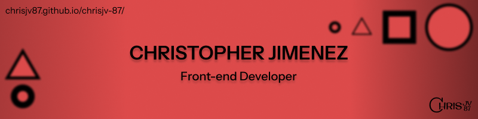

<h1 align="center"> Hi everyone! 😁</h1>
<h3 align="center">  </h3>
<h2 align="center">About me: 👨🏻‍💻</h2>

💻🖱️ I am a web developer with a year and a half of experience focused on JavaScript, I know how to use technologies like React.js

⚙️🧠 I love solving problems, creating solid architectures, making use of modules and reusing components to facilitate scalability in projects, always planning the problem before writing the code.

🎨✨ I enjoy developing beautiful and nice interfaces with code in CSS and its preprocessors, as well as creating wireframes with tools like Figma.

🎒📚 Student of the Platzi Web Development school since 2022 and in parallel in a self-taught way. 

<h2 align="center">Find me on the web: 📡</h2>

- Visite my website [click here](https://chrisjv87.github.io/chrisjv-87/)

- Contact me at my email jimenez.valverde0805@gmail.com

- Know more about me on my 

<h2 align="center">Some technologies I use:</h2>
<h2 align="center">
             